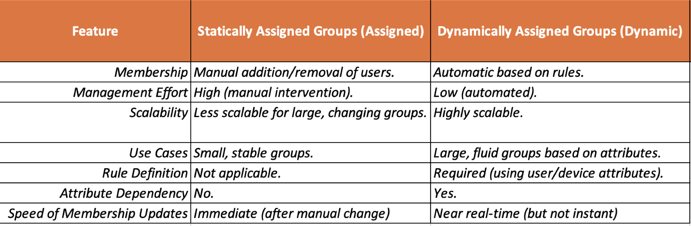
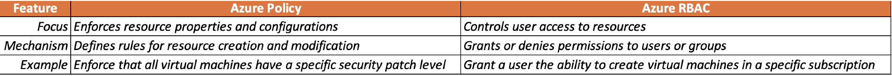

azure cmds for 104 and Learning important stuff

AD Sync : 
Steps for Immediate Replication of User Creation (Most Common Scenario):

1. Create the user in on-premises Active Directory.

2. Open PowerShell on the Azure AD Connect server as an administrator.

3. Run the following commands:

PowerShell

Import-Module ADSync
Start-ADSyncSyncCycle -PolicyType Delta
Wait a few minutes (usually 1-5 minutes, but can vary).

Check Azure AD to confirm the user has been synchronized.

Example with Error Handling:

PowerShell

try {
    Import-Module ADSync
    Start-ADSyncSyncCycle -PolicyType Delta
    Write-Host "Delta synchronization initiated."
}
catch {
    Write-Error "Error initiating delta synchronization: $($_.Exception.Message)"
}

--------------------

full sync

How to Perform a Full Sync:

Using PowerShell:

PowerShell

Import-Module ADSync
Start-ADSyncSyncCycle -PolicyType Initial

--------------------

NetLogon Service

The NetLogon service is a crucial component of Windows Server operating systems in a domain environment. It's responsible for locating domain controllers, authenticating users and computers, and maintaining secure communication channels within the domain.   

Here's a breakdown of its key functions:

1. Domain Controller Discovery:

2. User and Computer Authentication:

 
3. Maintaining Secure Channels:

4. Other Important Functions:

Pass-through Authentication: In scenarios where a user is trying to access a resource on a different server within the domain, the NetLogon service can facilitate pass-through authentication, allowing the user to access the resource without having to re-enter their credentials.   
Maintaining DNS Records: The NetLogon service dynamically registers and updates DNS records for domain controllers, which helps clients locate them. 
  
Why is the NetLogon Service Important?

Core Authentication Mechanism: It's fundamental to the authentication process in a Windows domain. Without the NetLogon service, users and computers wouldn't be able to log in to the domain or access domain resources.   
Security: It establishes secure communication channels, protecting authentication credentials and other sensitive information.   
Centralized Management: It enables centralized management of users and resources through Active Directory.
Troubleshooting NetLogon Issues:
-----------------

/Users/mac/Applications/azure104Learning/azuredeploy.json  - template path

---------------------------

Entra ID powershell cmds

# Create a new security group named "IT Admins"
New-AzRoleAssignment -RoleDefinitionName "Contributor" -Scope "/subscriptions/<your_subscription_id>" -Assignee "<user_principal_name>" 

# Example with user principal name
New-AzRoleAssignment -RoleDefinitionName "Contributor" -Scope "/subscriptions/<your_subscription_id>" -Assignee "user@example.com" 

# Example with service principal
New-AzRoleAssignment -RoleDefinitionName "Contributor" -Scope "/subscriptions/<your_subscription_id>" -Assignee "<service_principal_id>"

Explanation:

New-AzRoleAssignment: This cmdlet is used to create a role assignment in Azure.
RoleDefinitionName: Specifies the role to assign. In this case, "Contributor" provides broad permissions for managing resources within the subscription.
Scope: Defines the scope of the role assignment. "/subscriptions/<your_subscription_id>" indicates that the role is assigned at the subscription level.
Assignee: Specifies the user or entity to whom the role is assigned. You can use the user's principal name (UPN) or the service principal ID.
Official Command Reference:

New-AzRoleAssignment: You can find the official documentation and detailed information about this cmdlet on the Microsoft Docs website: https://learn.microsoft.com/en-us/azure/role-based-access-control/role-assignments-powershell
Note:

Replace <your_subscription_id>, <user_principal_name>, and <service_principal_id> with the actual values.
You can use the Get-AzSubscription cmdlet to retrieve your subscription ID.
You can use the Get-AzADUser cmdlet to retrieve the user's principal name.
This command will create a security group named "IT Admins" and assign the "Contributor" role to the specified user or service principal at the subscription level. This allows the assigned entity to perform a wide range of management operations within the subscription.

--------------------

Key Differences between internal users and external users in Entra ID:

Ownership: Internal users are owned and managed by your organization. External users are owned and managed by their own organization or themselves.
Authentication: Internal users authenticate directly against your Azure AD. External users federate their authentication through their own identity provider.
Licensing: Internal users generally require licenses from your organization. External users usually don't require licenses for basic guest access to resources.

Key takeaways

A tenant represents your organization and helps you to manage a specific instance of Microsoft cloud services for your internal and external users.
Microsoft Entra ID has user and guest accounts. Each account has a level of access specific to the scope of work expected to be done.
Groups combine together related users or devices. There are two types of groups including Security and Microsoft 365.
Group membership can be statically or dynamically assigned.

----------------------------------------------------

Azure PowerShell Commands:

Add a Resource Lock:

New-AzResourceLock -ResourceGroupName <ResourceGroupName> -LockLevel "CanNotDelete" -LockName <LockName>

Delete a Resource Lock:

Remove-AzResourceLock -ResourceGroupName <ResourceGroupName> -LockName <LockName> -Force 

Azure CLI Commands:

Add a Resource Lock:
Code snippet

az resource lock create --name <LockName> --lock-type CanNotDelete --resource-group <ResourceGroupName>
Delete a Resource Lock:
Code snippet

az resource lock delete --name <LockName> --resource-group <ResourceGroupName>

ResourceGroupName: Replace with the actual name of your resource group.
LockName: Replace with a unique name for the lock.
LockLevel: "CanNotDelete" is the most common lock level, preventing deletion of the resource group and its contents. Other levels include "ReadOnly" and "None" (to remove a lock).
-Force: This parameter is used with the Remove-AzResourceLock cmdlet to confirm the deletion of the lock.

------------------------------

